# Robot Primitives Software Stack Architecture

## Overview

The Robot Primitives software stack can be organized into four primary layers:

1. **Device Platform**
2. **Primitive Runtime**
3. **Primitive Services**
4. **Behavior Graph**

A fifth supporting concept, **Bridges**, connects the Robot Primitives messaging model to external transports such as ROS 2, Lighthouse Mesh, and REST.

The architecture can be summarized as:

> **Platform:** What can this hardware run?
> **Runtime:** How does Robot Primitives operate?
> **Services:** What can this device do?
> **Behavior:** What should this device do?

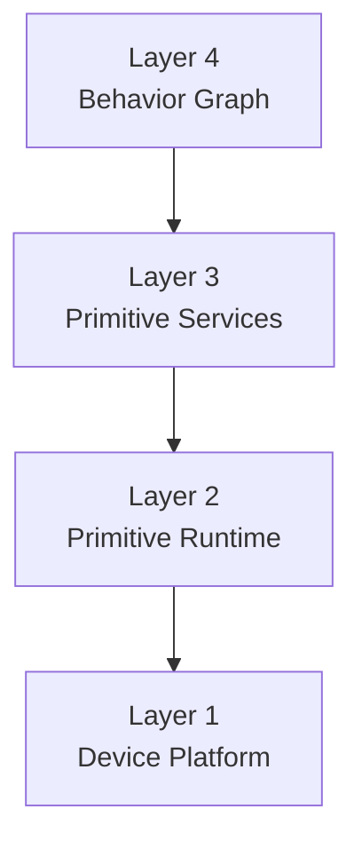

---

# Layer 1 — Device Platform

The **Device Platform** provides the compiled firmware environment required to support Robot Primitives on a particular hardware platform.

This layer consists primarily of native or firmware-level functionality.

Typical components include:

* MicroPython
* ROSMicroPy
* Robot Primitives Observability
* Lighthouse Mesh
* Native C/C++ drivers
* Board Support Package
* RTOS or low-level hardware abstractions

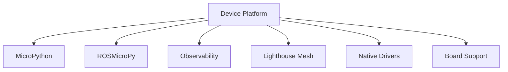

## Deployment Artifact

The output of this layer is a compiled firmware image.

Example:

```text
rp-platform-esp32s3-v1.4.0.bin
rp-platform-esp32p4-v1.4.0.bin
rp-platform-nrf9151-v1.4.0.bin
```

The firmware image should ideally describe the **hardware/runtime environment**, rather than the application deployed on the device.

For example, prefer:

```text
rp-platform-esp32s3.bin
```

rather than:

```text
object-camera-firmware.bin
servo-controller-firmware.bin
```

unless a particular device genuinely requires specialized native firmware.

This leads to an important architectural principle:

> **Firmware defines what the hardware can support; services define what the device is.**

---

# Layer 2 — Primitive Runtime

The **Robot Primitives Runtime** provides the common execution environment used by every Robot Primitives device.

This layer should remain largely identical across deployments.

Typical functionality includes:

```text
rp_runtime/
├── supervisor/
├── registry/
├── signals/
├── config/
├── cli/
├── debug/
├── package/
└── boot/
```

## Runtime Responsibilities

The runtime is responsible for:

* Startup and shutdown
* Service lifecycle management
* Service discovery
* Configuration management
* Package management
* Signal registration
* Local message routing
* CLI support
* Remote REPL
* Remote debugging
* Remote filesystem access
* Health monitoring
* Logging and tracing
* Watchdog functionality
* Service restart and recovery

---

## Service Supervisor

Rather than making `init.d` the architectural concept, the runtime can expose a **Service Supervisor**.

The supervisor manages the lifecycle of Primitive Services.

Conceptually:

```python
supervisor.register(service)

supervisor.start(service)
supervisor.stop(service)
supervisor.restart(service)
```

The filesystem or configuration mechanism may still resemble Linux `init.d`, but internally the architectural abstraction is a **Supervisor**.

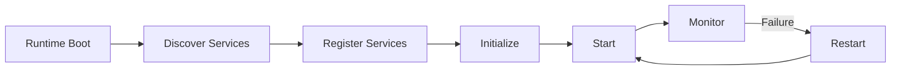

---

# Layer 3 — Primitive Services

The **Primitive Services** layer contains small, reusable component drivers and the abstractions used to compose them into higher-level device capabilities.

Every driver is managed as a Primitive Service and therefore participates in the common lifecycle, configuration, discovery, health, and signaling model. Hardware-specific code remains behind stable capability interfaces.

## Service-layer decomposition

| Concept | Responsibility | Example |
|---|---|---|
| **Capability Interface** | Defines a stable, hardware-independent contract | Position observer, motion actuator |
| **Individual Driver** | Controls or observes one physical or software component | TMC5160 stepper driver, VL53 ToF driver |
| **Adapter** | Translates one capability or representation into another | Distance-to-linear-position adapter |
| **Composite Driver** | Combines multiple capabilities into a higher-level capability | Observed linear actuator |
| **Service Manifest** | Declares identity, lifecycle, capabilities, dependencies, actions, and signals | YAML or Python manifest |

A **Primitive Service** is the runtime-managed unit. Individual drivers, adapters, and composite drivers are all kinds of Primitive Service.

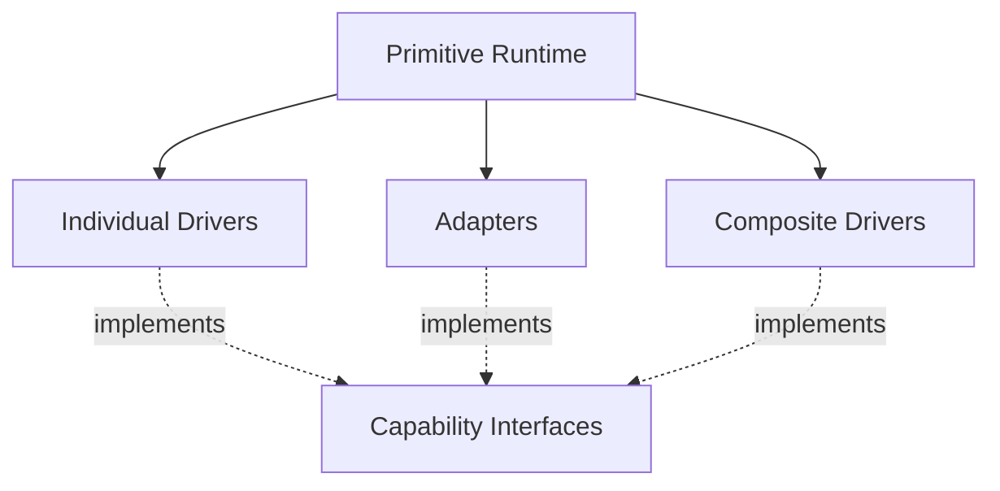

## Design rules

1. Drivers expose capabilities through interfaces rather than concrete device APIs.
2. Composite drivers depend on capability interfaces and constraints, not vendor or model names.
3. Raw measurements retain their physical meaning; adapters add installation-specific interpretation.
4. Units, reference frames, validity, timestamps, and quality are explicit at interface boundaries.
5. The runtime binds dependencies from manifests and the Device Manifest.
6. Hardware-specific configuration remains with the individual driver.
7. Device-specific calibration belongs to an adapter or deployed-device configuration.
8. A composite driver may know the roles of its subsystems, but it should not construct or import their concrete implementations.

---

## Capability Interfaces

A **Capability Interface** defines what a component can do without defining how a particular device implements it.

Interfaces are narrower than services:

* The **Primitive Service contract** defines lifecycle and runtime management.
* A **Capability Interface** defines a functional API such as observing position or commanding motion.
* One service may implement several capability interfaces.
* Multiple unrelated drivers may implement the same capability interface.

Examples include:

```text
PositionObserver
DistanceObserver
MotionActuator
PositionActuator
VelocityActuator
DigitalInput
DigitalOutput
ImageSource
ObjectDetector
```

An interface should have an independently versioned identifier:

```yaml
interface: motion.position_observer
version: 1
```

The major version is part of compatibility resolution. Implementations can evolve without forcing composites to depend on their package or class names.

### Interface capability descriptors

Manifests should describe semantic constraints in addition to the interface name.

```yaml
capability:
  interface: motion.position_observer
  version: 1
  dimensions: 1
  quantity: linear
  canonical_unit: m
  reference_frame: carriage
```

This prevents a composite requiring linear position from accidentally binding to an angular observer merely because both implement `PositionObserver`.

---

## Physical quantities and position

`PositionObserver` can represent both linear and angular position, but every sample must identify the quantity being measured.

Conceptually:

```python
class PositionSample:
    kind: str            # "linear" or "angular"
    value: float
    unit: str            # canonical: "m" or "rad"
    reference_frame: str
    timestamp_ns: int
    valid: bool
    quality: float       # normalized 0.0 through 1.0
```

The interface can be kept small:

```python
class PositionObserver:

    def position(self) -> PositionSample:
        ...

    def start_observing(self, rate_hz=None):
        ...

    def stop_observing(self):
        ...
```

Typical implementations include:

| Implementation | Position kind | Source |
|---|---|---|
| Servo feedback | Angular | Encoder or internal servo feedback |
| Rotary encoder | Angular | Shaft angle |
| Linear encoder | Linear | Carriage displacement |
| ToF position adapter | Linear | Distance transformed through installation calibration |
| Step-count estimator | Linear or angular | Motor steps transformed through mechanism geometry |

The canonical interface units should normally be SI units:

* Linear position: metres (`m`)
* Angular position: radians (`rad`)
* Linear velocity: metres per second (`m/s`)
* Angular velocity: radians per second (`rad/s`)

A driver may use native units internally. Conversion occurs at the interface boundary. Constrained devices may use documented scaled integers on the wire while preserving the same physical-unit semantics.

### Raw observation versus installed meaning

A ToF sensor natively observes **distance along a sensing ray**. It does not inherently know that the reading represents a carriage position.

For that reason, the preferred decomposition is:

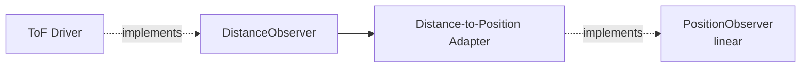

The adapter owns installation-specific information such as:

* zero offset,
* direction or inversion,
* usable range,
* reference frame,
* filtering,
* calibration curve,
* out-of-range handling.

A tightly integrated product may implement `PositionObserver` directly in its ToF driver, but keeping the adapter separate makes the raw sensor driver reusable.

---

## Individual Drivers

An **Individual Driver** represents one independently addressable component or software endpoint.

Examples include:

```text
drivers/
├── tmc5160_stepper/
├── servo42c/
├── vl53l1x_tof/
├── vl53l7cx_array/
├── mt6816_encoder/
├── bno085_imu/
└── camera/
```

An individual driver should:

* own the hardware protocol and device-specific configuration,
* implement the Primitive Service lifecycle,
* expose one or more capability interfaces,
* publish normalized signals,
* report health and diagnostics,
* avoid embedding knowledge of the larger mechanism.

A ToF driver, for example, should know how to initialize the sensor, obtain valid ranges, and report sensor faults. It should not need to know that it is mounted on a linear actuator.

---

## Adapters

An **Adapter** is a small Primitive Service that changes representation or semantics without coordinating a multi-component operation.

Examples include:

* distance to linear position,
* encoder counts to angular position,
* PWM duty cycle to normalized effort,
* local signal to ROS message schema,
* raw switch state to a debounced limit observation.

Adapters make installation knowledge explicit and keep both individual and composite drivers reusable.

```python
class DistanceToPositionAdapter(PositionObserver):

    def __init__(self, distance_observer, calibration):
        self.distance_observer = distance_observer
        self.calibration = calibration

    def position(self):
        distance = self.distance_observer.distance()
        return self.calibration.to_linear_position(distance)
```

---

## Composite Drivers

A **Composite Driver** combines two or more component capabilities and exposes a higher-level, consistent interface.

A composite driver:

* implements the same lifecycle contract as an individual driver,
* declares required and optional capability dependencies,
* receives bound service instances from the runtime,
* coordinates actions and observations,
* owns mechanism-level safety and completion logic,
* exposes a capability that hides the internal composition.

A composite driver should depend on roles, interfaces, and constraints:

```yaml
requires:
  motor:
    interface: motion.motion_actuator
    version: 1

  position:
    interface: motion.position_observer
    version: 1
    constraints:
      quantity: linear
      dimensions: 1
```

It should not depend directly on concrete package names such as `TMC5160` or `VL53L1X`.

This allows the same composite implementation to use:

* a different stepper controller,
* an encoder instead of a ToF sensor,
* simulated components during testing,
* a remote capability exposed through Lighthouse,
* a ROS-backed capability supplied through a bridge.

---

## Example: observed linear actuator

Consider a linear actuator driven by a stepper motor, with a ToF sensor measuring carriage position.

The components are decomposed as follows:

| Role | Implementation | Interface exposed |
|---|---|---|
| Motor | Stepper motor driver | `MotionActuator` |
| Raw sensor | ToF distance driver | `DistanceObserver` |
| Position conversion | Distance-to-position adapter | `PositionObserver` with `quantity: linear` |
| Mechanism | Observed linear actuator composite | `PositionActuator` |

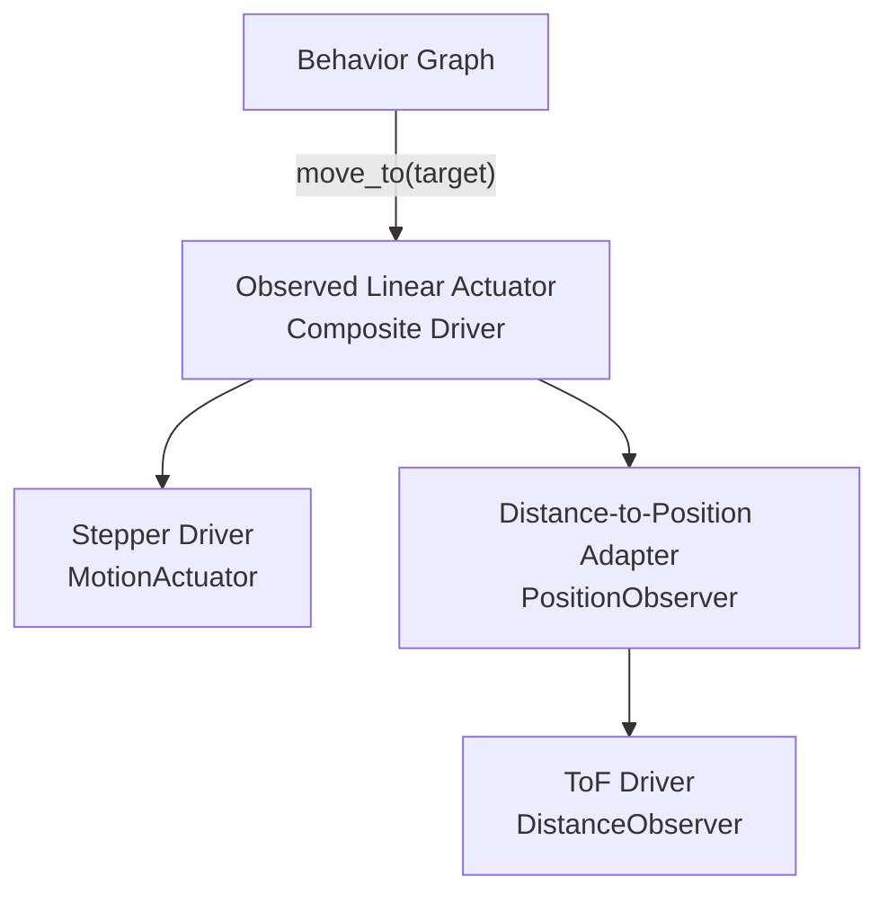

The composite driver can have detailed knowledge of how a linear actuator behaves—target tolerance, approach direction, homing, limits, timeout, stall detection, and completion—but it communicates with its components only through the declared interfaces.

Conceptually:

```python
class ObservedLinearActuator(PositionActuator):

    def __init__(self, motor: MotionActuator,
                 position: PositionObserver,
                 config):
        self.motor = motor
        self.position_observer = position
        self.config = config

    def move_to(self, target):
        current = self.position_observer.position()
        self._validate_target(target, current)
        self.motor.command(self._motion_for(target, current))

    def update(self):
        current = self.position_observer.position()

        if self._target_reached(current):
            self.motor.stop()
            self.publish("motion.target.reached", current)

        elif self._unsafe_or_timed_out(current):
            self.motor.stop()
            self.publish("motion.target.failed", current)
```

The composite may implement closed-loop control itself or delegate it to the motor controller. That choice is an implementation detail; the external `PositionActuator` contract remains consistent.

---

## Service Lifecycle

Every individual driver, adapter, and composite driver implements the common Primitive Service lifecycle.

```python
class PrimitiveService:

    def configure(self, config):
        ...

    def init(self):
        ...

    def start(self):
        ...

    def stop(self):
        ...

    def reset(self):
        ...

    def status(self):
        ...
```

The lifecycle contract should remain independent of the functional interfaces. For example, a stepper service can implement both `PrimitiveService` and `MotionActuator`.

---

# Service Manifest

Rather than requiring every service to register itself procedurally, each service exposes a declarative **Service Manifest**.

An individual ToF driver might declare:

```yaml
service:
  name: vl53l1x
  kind: individual_driver
  type: sensor.tof

  implements:
    - interface: sensing.distance_observer
      version: 1

  provides_signals:
    - range.distance.updated
    - device.health.changed
```

The distance-to-position adapter might declare:

```yaml
service:
  name: carriage_position
  kind: adapter
  type: adapter.distance_to_position

  implements:
    - interface: motion.position_observer
      version: 1
      quantity: linear

  requires:
    distance:
      interface: sensing.distance_observer
      version: 1
```

The composite linear actuator might declare:

```yaml
service:
  name: observed_linear_actuator
  kind: composite_driver
  type: motion.linear_actuator

  implements:
    - interface: motion.position_actuator
      version: 1
      quantity: linear

  requires:
    motor:
      interface: motion.motion_actuator
      version: 1

    position:
      interface: motion.position_observer
      version: 1
      constraints:
        quantity: linear

  actions:
    - motion.move_to
    - motion.home
    - motion.stop

  provides_signals:
    - motion.started
    - motion.position.updated
    - motion.target.reached
    - motion.target.failed
```

The runtime uses these manifests to discover capabilities, validate compatibility, resolve dependencies, and start services in dependency order.

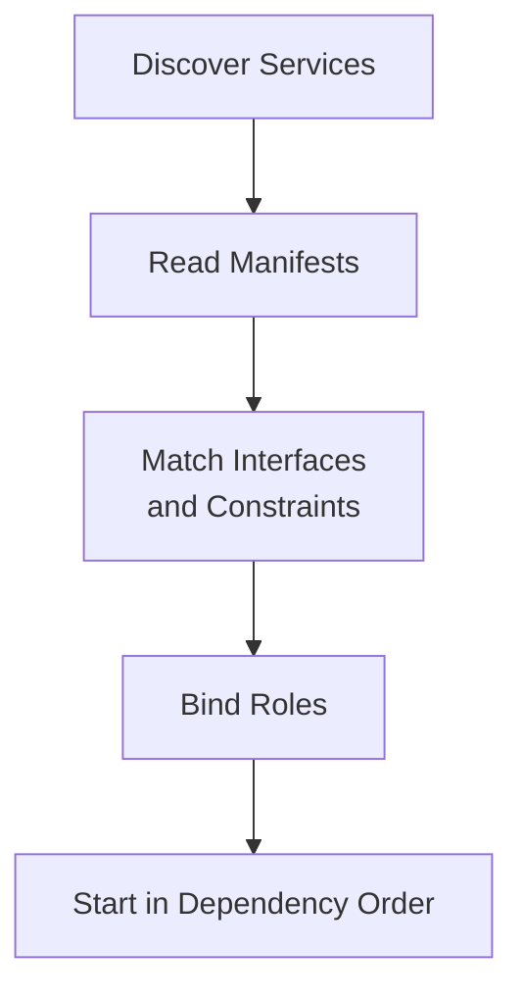

### Explicit device binding

Automatic matching is useful, but a Device Manifest should be able to bind a role explicitly when multiple compatible providers exist.

```yaml
device:
  id: axis.lift

  services:
    stepper:
      package: drivers.tmc5160_stepper

    tof:
      package: drivers.vl53l1x_tof

    carriage_position:
      package: adapters.distance_to_position
      bind:
        distance: tof
      config:
        zero_offset_m: 0.018
        direction: -1
        reference_frame: lift.base

    lift:
      package: composites.observed_linear_actuator
      bind:
        motor: stepper
        position: carriage_position
```

The composite knows that it has a `motor` and a `position` role. It does not need to know which hardware models fulfill those roles.

---

# Robot Primitive Definition

A **Robot Primitive** can be formally defined as:

> A discoverable capability with a defined lifecycle, configuration schema, interfaces, traits, actions, signals, and health state.

Conceptually:

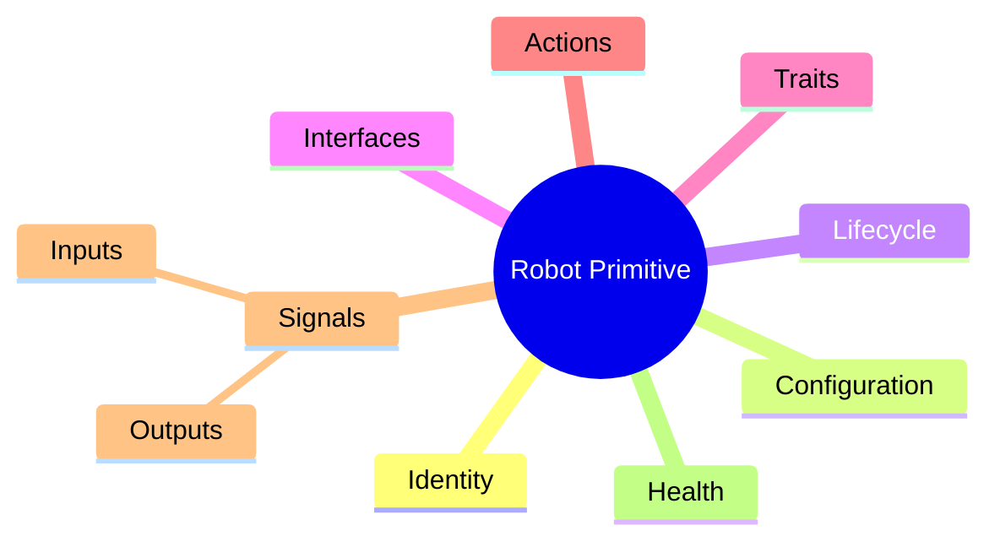

A single Primitive Service may expose one or more Robot Primitives or capability interfaces.

For example, an object-detection camera might expose:

```text
Primitive Node: front_camera

Provides:
    ImageSource
    ObjectDetector
    DistanceObserver
```

This keeps the physical device, service implementation, and logical capabilities distinct.

---


# Signals

Robot Primitives should define its own messaging abstraction rather than using ROS-specific terminology at the architectural level.

The core concept should be a **Signal**.

Signals can be routed through multiple transports without the service needing to know which transport is being used.

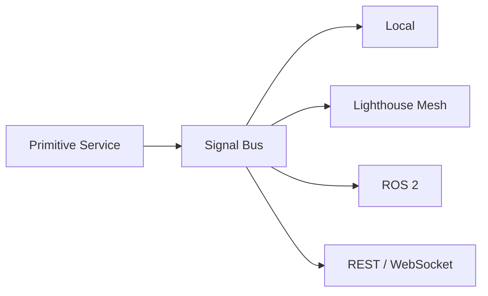

Possible terminology:

* Signal
* Signal Bus
* Signal Provider
* Signal Consumer
* Signal Bridge

A service might declare:

```yaml
provides:
  - vision.object.detected
  - vision.object.lost

consumes:
  - camera.frame
```

The service itself does not need to know whether the signal remains local or crosses a network.

---

# Actions vs Signals

It is useful to distinguish between **Actions** and **Signals**.

## Signals

Signals represent events or changes in state.

Examples:

```text
vision.object.detected
vision.object.lost

range.distance.updated

motion.servo.started
motion.servo.complete

device.health.changed
```

## Actions

Actions represent requests for something to happen.

Examples:

```text
camera.capture

servo.move
servo.home

gripper.open
gripper.close

slide.move
```

The typical interaction becomes:

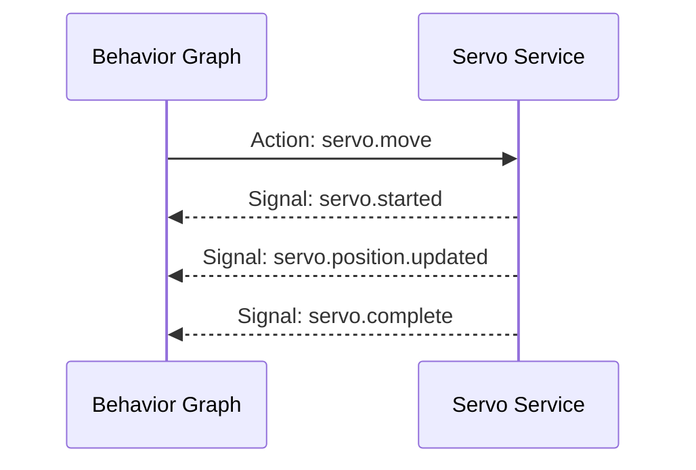

This distinction becomes particularly important when supporting:

* Timeouts
* Cancellation
* Retries
* Completion acknowledgement
* Error handling
* Long-running operations

---

# Signal Naming Convention

A hierarchical naming convention should be used.

Recommended format:

```text
domain.component.event
```

Examples:

```text
vision.object.detected
vision.object.lost

range.distance.updated

motion.servo.started
motion.servo.complete

system.service.started
system.service.failed

device.health.changed
```

Actions may follow a similar convention:

```text
vision.camera.capture

motion.servo.move
motion.servo.home

motion.gripper.open
motion.gripper.close
```

---

# Resource Identity

Signal type and signal source should remain separate.

Avoid identifiers such as:

```text
front_left_object_camera_object_detected
```

Instead use:

```yaml
source: vision.front.camera
signal: vision.object.detected
```

This allows the same signal definition to be reused by multiple instances.

For example:

```text
source: robot.arm.left.shoulder
signal: motion.servo.complete
```

and:

```text
source: robot.arm.right.shoulder
signal: motion.servo.complete
```

use the same signal schema.

---

# Bridges

External communication technologies should be modeled as **Bridges** rather than being built directly into Primitive Services.

Examples include:

* ROS 2 Bridge
* Lighthouse Mesh Bridge
* REST Bridge
* WebSocket Bridge
* MQTT Bridge

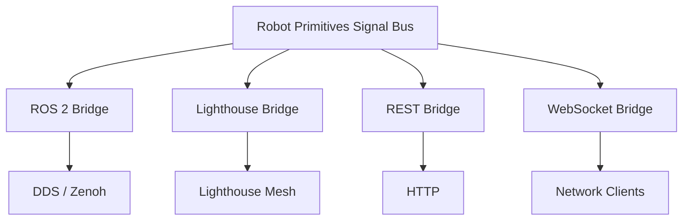

The purpose of this separation is to prevent transport-specific concepts from leaking into Primitive Services.

---

# Layer 4 — Behavior Graph

The **Behavior Graph** describes how Primitive Services interact.

Rather than implementing operational logic directly in Python, much of the coordination can be expressed declaratively as data.

A behavior can describe:

* Events
* Conditions
* Actions
* Dependencies
* Sequencing
* State transitions
* Timeouts
* Error handling
* Retry behavior

---

## Behavior Example

Consider an object-detection system controlling a robotic gripper.

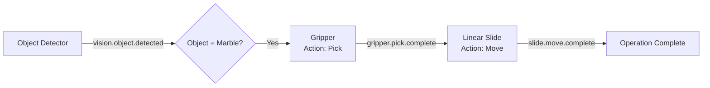

The behavior could be represented as:

```yaml
behavior:
  name: ball_transfer

  flows:

    - when:
        signal: vision.object.detected

        match:
          class: marble
          confidence: ">0.85"

      do:
        service: gripper
        action: pick

    - when:
        signal: gripper.pick.complete

      do:
        service: slide
        action: move

        parameters:
          position: far
```

The stored configuration can be called a **Behavior Definition**.

Example:

```text
ball_sorter.behavior.yaml
maze_solver.behavior.yaml
fire_monitor.behavior.yaml
```

When instantiated and executed, the definition becomes a **Behavior Graph**.

---

# Device Manifest

In addition to the four software layers, each deployed node should have a **Device Manifest**.

The Device Manifest describes what a particular physical node contains.

For example:

```yaml
device:

  id: vision.front.left

  model: rp.object_camera.v1

  services:
    - camera
    - object_detector
    - tof.left
    - tof.right

  traits:
    - vision
    - object_detection
    - ranging

  interfaces:
    - lighthouse
    - ros2
```

The Device Manifest is configuration rather than a separate architectural layer.

It effectively assembles the device from available Primitive Services.

---

# Deployment Model

A complete Robot Primitives device consists of:

```text
Platform Image
    +
Primitive Runtime
    +
Primitive Service Packages
    +
Device Manifest
    +
Behavior Definitions
```

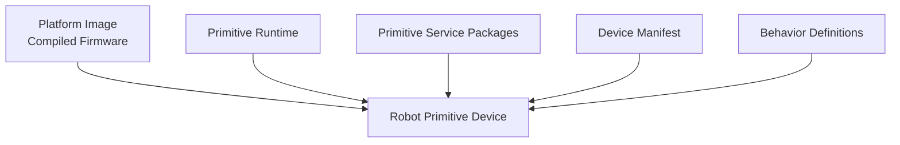

This allows the same firmware and runtime to produce radically different devices based primarily on configuration and installed services.

---

# Complete Architecture

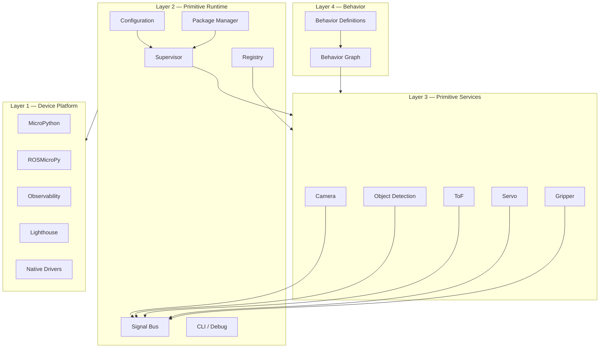

---

# Communications Architecture

The internal Robot Primitives interface remains transport-independent.

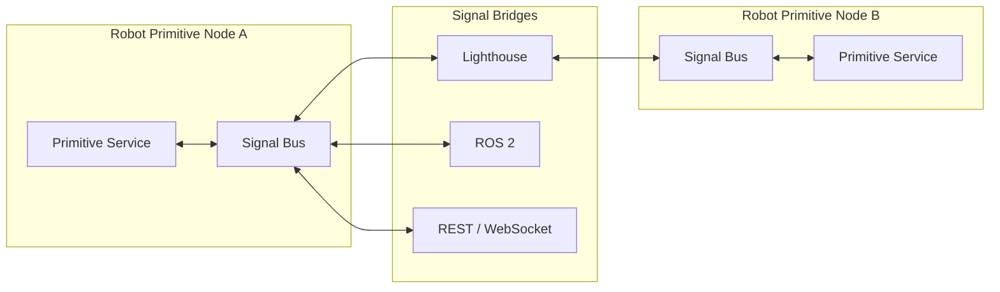

The Primitive Service does not need to know whether its signal:

* stays within the local process,
* travels to another Robot Primitive device,
* becomes a ROS 2 topic,
* is exposed through REST,
* or is transported over Lighthouse Mesh.

---

# Repository Naming Convention

A repository structure could mirror the architecture directly.

```text
robot-primitives/
│
├── rp-platform/
│   ├── esp32s3/
│   ├── esp32p4/
│   └── nrf91/
│
├── rp-runtime/
│   ├── supervisor/
│   ├── registry/
│   ├── signals/
│   ├── config/
│   └── cli/
│
├── rp-services/
│   ├── interfaces/
│   │   ├── motion/
│   │   ├── sensing/
│   │   └── vision/
│   ├── drivers/
│   │   ├── individual/
│   │   └── composite/
│   ├── adapters/
│   └── schemas/
│
├── rp-behaviors/
│   ├── schemas/
│   ├── engine/
│   └── definitions/
│
└── rp-bridges/
    ├── ros2/
    ├── lighthouse/
    └── rest/
```

---

# Architectural Summary

The Robot Primitives architecture can therefore be expressed as:

```text
Device Platform
      ↓
Primitive Runtime
      ↓
Primitive Services
      ↓
Behavior Graph
```

With supporting components:

```text
              Bridges
                 │
                 ▼
Device Platform → Runtime → Services → Behavior
                       ↑
                 Device Manifest
```

More precisely:

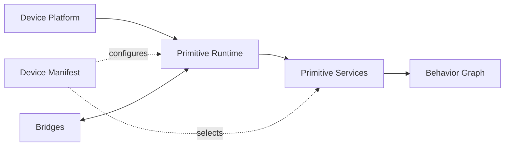

The core architectural principles are:

1. **Firmware defines what the hardware can support.**
2. **Services define what the device can do.**
3. **The Device Manifest defines what this particular node is.**
4. **Behavior Definitions define how capabilities are coordinated.**
5. **Signals provide transport-independent communication.**
6. **Actions represent requests; Signals represent events and state changes.**
7. **Bridges isolate ROS, Lighthouse, REST, and other communication mechanisms from application logic.**
8. **Primitive Services expose standardized lifecycle, capability, health, and messaging contracts.**

The result is a system where robotic devices can increasingly be assembled from reusable capabilities rather than written as monolithic applications.
