# Robot Primitives Software Stack Architecture

## Overview

The Robot Primitives software stack can be organized into four primary layers:

1. **Device Platform**
2. **Primitive Runtime**
3. **Primitive Services**
4. **Behavior Graph**

A fifth supporting concept, **Bridges**, connects the Robot Primitives messaging model to external transports such as ROS 2, Lighthouse Mesh, and REST.

The architecture can be summarized as:

> **Platform:** What can this hardware run?
> **Runtime:** How does Robot Primitives operate?
> **Services:** What can this device do?
> **Behavior:** What should this device do?

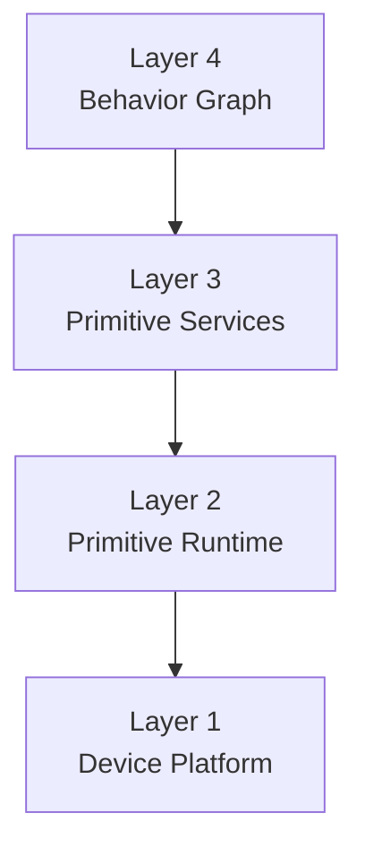

---

# Layer 1 — Device Platform

The **Device Platform** provides the compiled firmware environment required to support Robot Primitives on a particular hardware platform.

This layer consists primarily of native or firmware-level functionality.

Typical components include:

* MicroPython
* ROSMicroPy
* Robot Primitives Observability
* Lighthouse Mesh
* Native C/C++ drivers
* Board Support Package
* RTOS or low-level hardware abstractions

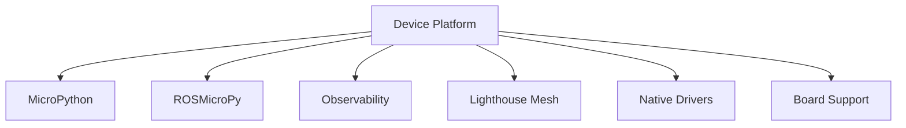

## Deployment Artifact

The output of this layer is a compiled firmware image.

Example:

```text
rp-platform-esp32s3-v1.4.0.bin
rp-platform-esp32p4-v1.4.0.bin
rp-platform-nrf9151-v1.4.0.bin
```

The firmware image should ideally describe the **hardware/runtime environment**, rather than the application deployed on the device.

For example, prefer:

```text
rp-platform-esp32s3.bin
```

rather than:

```text
object-camera-firmware.bin
servo-controller-firmware.bin
```

unless a particular device genuinely requires specialized native firmware.

This leads to an important architectural principle:

> **Firmware defines what the hardware can support; services define what the device is.**

---

# Layer 2 — Primitive Runtime

The **Robot Primitives Runtime** provides the common execution environment used by every Robot Primitives device.

This layer should remain largely identical across deployments.

Typical functionality includes:

```text
rp_runtime/
├── supervisor/
├── registry/
├── signals/
├── config/
├── cli/
├── debug/
├── package/
└── boot/
```

## Runtime Responsibilities

The runtime is responsible for:

* Startup and shutdown
* Service lifecycle management
* Service discovery
* Configuration management
* Package management
* Signal registration
* Local message routing
* CLI support
* Remote REPL
* Remote debugging
* Remote filesystem access
* Health monitoring
* Logging and tracing
* Watchdog functionality
* Service restart and recovery

---

## Service Supervisor

Rather than making `init.d` the architectural concept, the runtime can expose a **Service Supervisor**.

The supervisor manages the lifecycle of Primitive Services.

Conceptually:

```python
supervisor.register(service)

supervisor.start(service)
supervisor.stop(service)
supervisor.restart(service)
```

The filesystem or configuration mechanism may still resemble Linux `init.d`, but internally the architectural abstraction is a **Supervisor**.

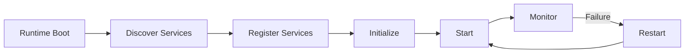

---

# Layer 3 — Primitive Services

A **Primitive Service** represents a hardware or software capability exposed through a standardized interface.

Examples include:

```text
services/
├── camera/
├── object_detector/
├── tof_array/
├── servo/
├── stepper/
├── imu/
├── gripper/
└── gps/
```

A Primitive Service should provide:

* Identity
* Configuration
* Lifecycle
* Capabilities
* Actions
* Signals consumed
* Signals produced
* Health information

---

## Service Lifecycle

Every service should implement a common lifecycle.

For example:

```python
class PrimitiveService:

    def configure(self, config):
        ...

    def init(self):
        ...

    def start(self):
        ...

    def stop(self):
        ...

    def reset(self):
        ...

    def status(self):
        ...
```

The exact implementation may vary, but the service contract should remain consistent.

---

# Service Manifest

Rather than requiring every service to manually register its capabilities, the service should expose a declarative **Service Manifest**.

Example:

```python
manifest = {
    "name": "object_detector",
    "type": "vision.object_detector",

    "provides": [
        "vision.object.detected",
        "vision.object.lost"
    ],

    "consumes": [
        "camera.frame"
    ],

    "optional": [
        "range.distance"
    ]
}
```

The runtime can then use the manifest to automatically configure the service.

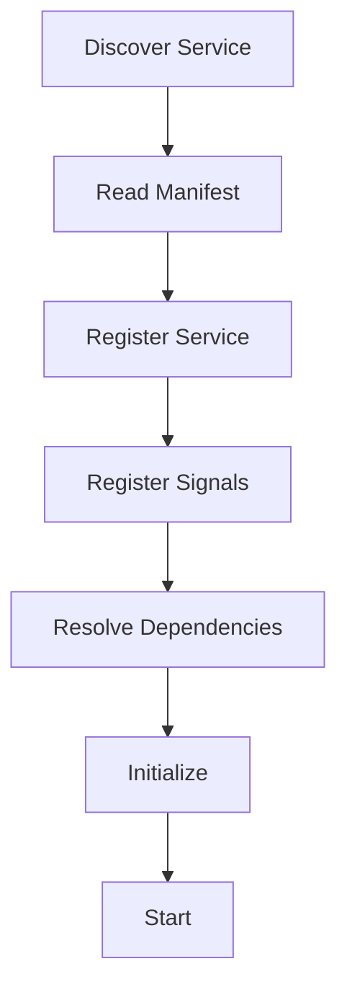

This provides a foundation for automatic dependency resolution and device composition.

---

# Robot Primitive Definition

A **Robot Primitive** can be formally defined as:

> A discoverable capability with a defined lifecycle, configuration schema, traits, actions, signals, and health state.

Conceptually:

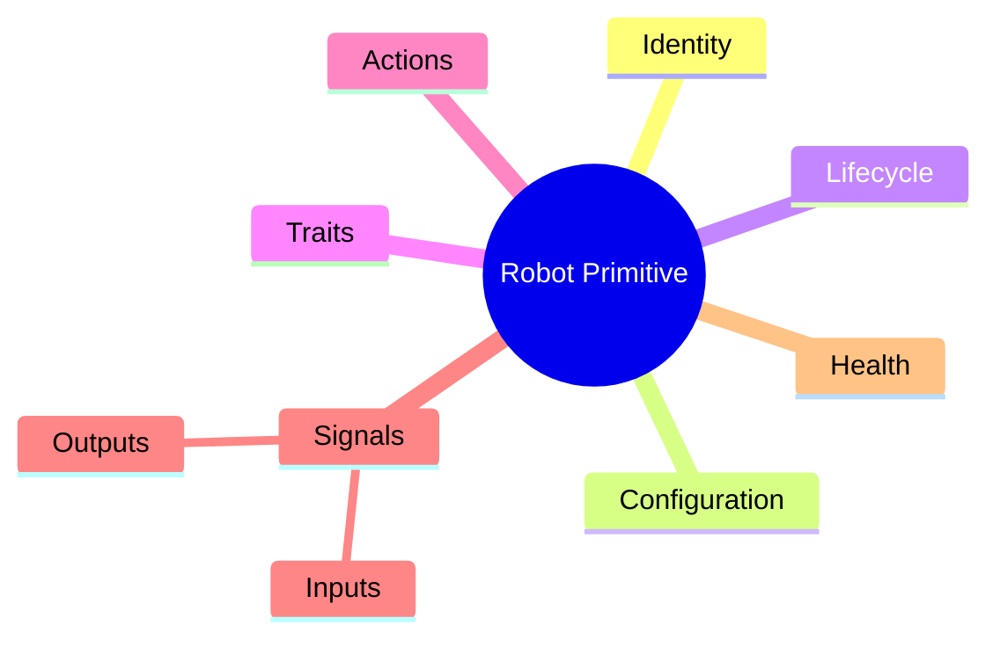

A single Primitive Service may expose one or more Robot Primitives.

For example, an object-detection camera might expose:

```text
Primitive Node: front_camera

Provides:
    camera
    object_detector
    range_sensor
```

This keeps the physical device separate from its logical capabilities.

---

# Signals

Robot Primitives should define its own messaging abstraction rather than using ROS-specific terminology at the architectural level.

The core concept should be a **Signal**.

Signals can be routed through multiple transports without the service needing to know which transport is being used.

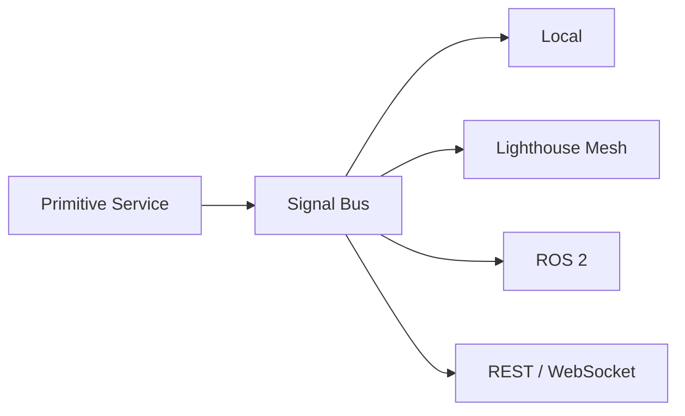

Possible terminology:

* Signal
* Signal Bus
* Signal Provider
* Signal Consumer
* Signal Bridge

A service might declare:

```yaml
provides:
  - vision.object.detected
  - vision.object.lost

consumes:
  - camera.frame
```

The service itself does not need to know whether the signal remains local or crosses a network.

---

# Actions vs Signals

It is useful to distinguish between **Actions** and **Signals**.

## Signals

Signals represent events or changes in state.

Examples:

```text
vision.object.detected
vision.object.lost

range.distance.updated

motion.servo.started
motion.servo.complete

device.health.changed
```

## Actions

Actions represent requests for something to happen.

Examples:

```text
camera.capture

servo.move
servo.home

gripper.open
gripper.close

slide.move
```

The typical interaction becomes:

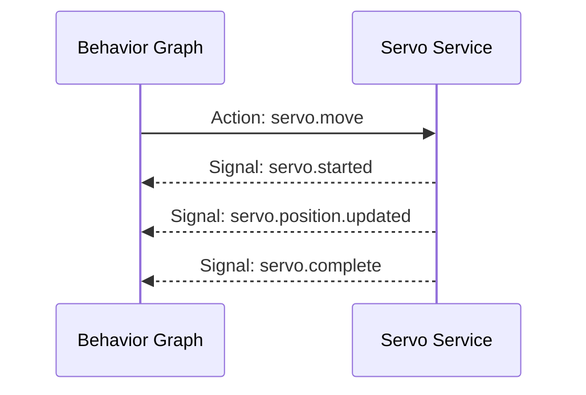

This distinction becomes particularly important when supporting:

* Timeouts
* Cancellation
* Retries
* Completion acknowledgement
* Error handling
* Long-running operations

---

# Signal Naming Convention

A hierarchical naming convention should be used.

Recommended format:

```text
domain.component.event
```

Examples:

```text
vision.object.detected
vision.object.lost

range.distance.updated

motion.servo.started
motion.servo.complete

system.service.started
system.service.failed

device.health.changed
```

Actions may follow a similar convention:

```text
vision.camera.capture

motion.servo.move
motion.servo.home

motion.gripper.open
motion.gripper.close
```

---

# Resource Identity

Signal type and signal source should remain separate.

Avoid identifiers such as:

```text
front_left_object_camera_object_detected
```

Instead use:

```yaml
source: vision.front.camera
signal: vision.object.detected
```

This allows the same signal definition to be reused by multiple instances.

For example:

```text
source: robot.arm.left.shoulder
signal: motion.servo.complete
```

and:

```text
source: robot.arm.right.shoulder
signal: motion.servo.complete
```

use the same signal schema.

---

# Bridges

External communication technologies should be modeled as **Bridges** rather than being built directly into Primitive Services.

Examples include:

* ROS 2 Bridge
* Lighthouse Mesh Bridge
* REST Bridge
* WebSocket Bridge
* MQTT Bridge

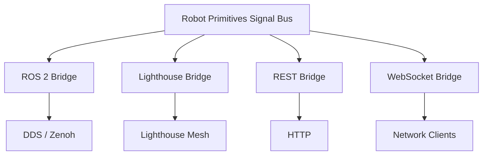

The purpose of this separation is to prevent transport-specific concepts from leaking into Primitive Services.

---

# Layer 4 — Behavior Graph

The **Behavior Graph** describes how Primitive Services interact.

Rather than implementing operational logic directly in Python, much of the coordination can be expressed declaratively as data.

A behavior can describe:

* Events
* Conditions
* Actions
* Dependencies
* Sequencing
* State transitions
* Timeouts
* Error handling
* Retry behavior

---

## Behavior Example

Consider an object-detection system controlling a robotic gripper.

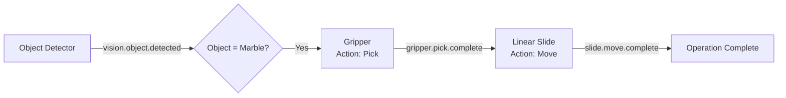

The behavior could be represented as:

```yaml
behavior:
  name: ball_transfer

  flows:

    - when:
        signal: vision.object.detected

        match:
          class: marble
          confidence: ">0.85"

      do:
        service: gripper
        action: pick

    - when:
        signal: gripper.pick.complete

      do:
        service: slide
        action: move

        parameters:
          position: far
```

The stored configuration can be called a **Behavior Definition**.

Example:

```text
ball_sorter.behavior.yaml
maze_solver.behavior.yaml
fire_monitor.behavior.yaml
```

When instantiated and executed, the definition becomes a **Behavior Graph**.

---

# Device Manifest

In addition to the four software layers, each deployed node should have a **Device Manifest**.

The Device Manifest describes what a particular physical node contains.

For example:

```yaml
device:

  id: vision.front.left

  model: rp.object_camera.v1

  services:
    - camera
    - object_detector
    - tof.left
    - tof.right

  traits:
    - vision
    - object_detection
    - ranging

  interfaces:
    - lighthouse
    - ros2
```

The Device Manifest is configuration rather than a separate architectural layer.

It effectively assembles the device from available Primitive Services.

---

# Deployment Model

A complete Robot Primitives device consists of:

```text
Platform Image
    +
Primitive Runtime
    +
Primitive Service Packages
    +
Device Manifest
    +
Behavior Definitions
```

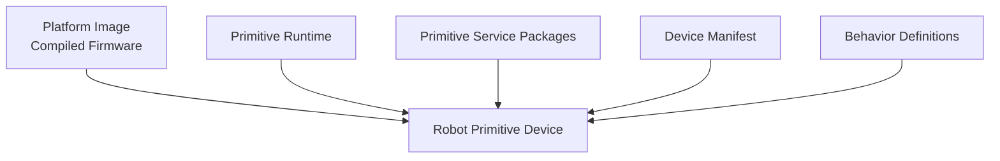

This allows the same firmware and runtime to produce radically different devices based primarily on configuration and installed services.

---

# Complete Architecture

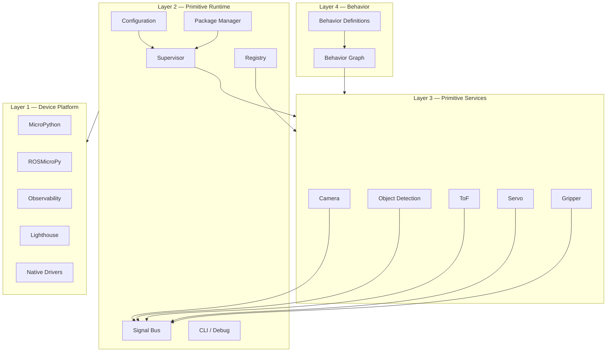

---

# Communications Architecture

The internal Robot Primitives interface remains transport-independent.

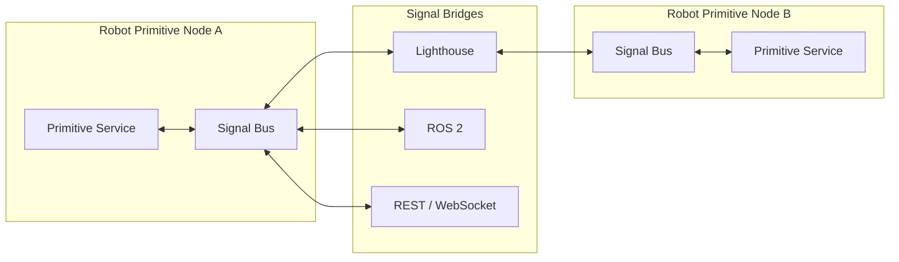

The Primitive Service does not need to know whether its signal:

* stays within the local process,
* travels to another Robot Primitive device,
* becomes a ROS 2 topic,
* is exposed through REST,
* or is transported over Lighthouse Mesh.

---

# Repository Naming Convention

A repository structure could mirror the architecture directly.

```text
robot-primitives/
│
├── rp-platform/
│   ├── esp32s3/
│   ├── esp32p4/
│   └── nrf91/
│
├── rp-runtime/
│   ├── supervisor/
│   ├── registry/
│   ├── signals/
│   ├── config/
│   └── cli/
│
├── rp-services/
│   ├── camera/
│   ├── object_detection/
│   ├── tof/
│   ├── servo/
│   └── imu/
│
├── rp-behaviors/
│   ├── schemas/
│   ├── engine/
│   └── definitions/
│
└── rp-bridges/
    ├── ros2/
    ├── lighthouse/
    └── rest/
```

---

# Architectural Summary

The Robot Primitives architecture can therefore be expressed as:

```text
Device Platform
      ↓
Primitive Runtime
      ↓
Primitive Services
      ↓
Behavior Graph
```

With supporting components:

```text
              Bridges
                 │
                 ▼
Device Platform → Runtime → Services → Behavior
                       ↑
                 Device Manifest
```

More precisely:

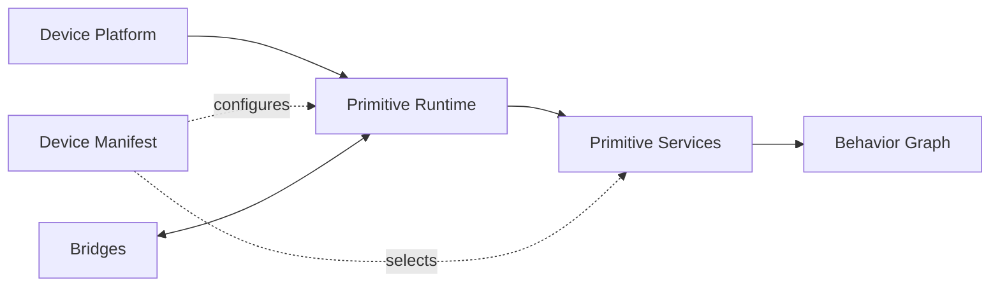

The core architectural principles are:

1. **Firmware defines what the hardware can support.**
2. **Services define what the device can do.**
3. **The Device Manifest defines what this particular node is.**
4. **Behavior Definitions define how capabilities are coordinated.**
5. **Signals provide transport-independent communication.**
6. **Actions represent requests; Signals represent events and state changes.**
7. **Bridges isolate ROS, Lighthouse, REST, and other communication mechanisms from application logic.**
8. **Primitive Services expose standardized lifecycle, capability, health, and messaging contracts.**

The result is a system where robotic devices can increasingly be assembled from reusable capabilities rather than written as monolithic applications.
