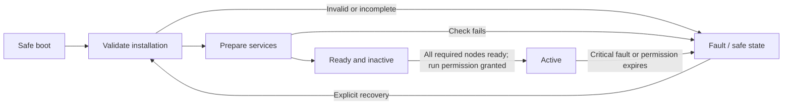

# Device provisioning and bootstrap

**Design proposal.** This page defines the intended Robot Architect provisioning,
update, and coordinated startup model. The update receiver, deployment inventory,
and robot-wide startup gate described here are not yet implemented. See
[Multiple Devices](deployment.html) for the current installation workflow.

## Responsibilities

Robot Architect resolves and delivers software. Devices verify what is installed
and report whether they are ready. Devices do not contact registries, resolve
dependencies, or fetch upgrades themselves.

| Component | Responsibility |
| --- | --- |
| Robot Architect | Browse registries, configure nodes, resolve dependencies, build exact deployments, compare inventories, and push updates |
| Device bootstrap runtime | Load identity, report inventory, receive and verify installations, prepare services, enforce local run permission, and retain recovery access |
| Onboard robot supervisor | Check all required nodes and grant or revoke permission to operate |
| Runtime catalog | Advertise observed identities, capabilities, and health for discovery and desktop visualization |

The desktop is a provisioning and maintenance tool. A correctly installed robot
must be able to boot and operate under its onboard supervisor without the desktop
or internet access. The catalog describes observed state; it does not itself
authorize operation. Its existing eventual-consistency timeouts are not a
substitute for a run-permission protocol.

## USB provisioning and identity

A base image needs MicroPython, ROSMicroPy, and a small bootstrap runtime that
works even when application packages or node manifests are missing. An
unprovisioned device remains inactive and reports `UNPROVISIONED` over USB.

Initial identity and hardware assignments are provisioned through a USB serial
cable using `mpremote`. Robot Architect reads the physical device identifier,
shows board information, and can request an identification indicator before
writing. It verifies the written manifest by reading it back. USB selects a
physical target, but a device binding is still needed to detect the wrong profile.

| Identity | Meaning |
| --- | --- |
| Device ID | Physical controller receiving the installation |
| Node ID | Logical role declared by a node manifest |
| Deployment ID | Exact approved set of manifests and software |
| Boot/session ID | Current runtime incarnation, used to reject stale readiness or activation messages |

A node manifest declares its services, apps, configuration, and bindings. Architect
binds it to the intended device during provisioning. Replacing a controller
requires explicitly rebinding its logical roles to the replacement device.
Wireless software maintenance does not silently reassign identity or hardware.

Dragging services or apps onto a device in Architect creates desired configuration.
Before provisioning, Architect validates dependencies, driver compatibility, pin
and peripheral ownership, and estimated storage and memory needs. A provisioned
device can appear as awaiting connection before it advertises an actual profile.

## Inventory and readiness

The device reports its firmware build and board type, active deployment ID,
manifest digest, installed package versions and content digests, missing or
damaged files, startup-check results, and readiness state. Version strings alone
do not identify a testing build; different commits can share a version.

Inventory is checked against the committed deployment. Presence alone is not
readiness: compatibility, successful preparation, required bindings, and any
required calibration must also be satisfied. Calibration that causes motion
needs a separately authorized operating mode; it must not run implicitly during
safe preparation.

Invalid manifests or missing application components must leave bootstrap health
reporting and recovery access available. The device remains inactive and exposes
an actionable fault, including the affected node or component and expected versus
observed state.

## Architect-managed updates

When Architect connects, it compares device inventories with the selected robot
deployment. Discovery requires an actual management connection, such as a radio
gateway; being within radio range does not by itself provide file transfer.

1. Resolve the selected registry sources into an exact deployment lock and cache
   its files on the desktop.
2. Compare device inventory against that deployment, rather than against whatever
   version happens to be newest in a registry.
3. Enter an allowed maintenance state and inhibit operation before changing files.
4. Push missing or changed files to a staging area. The device checks the target
   binding, compatibility, complete file set, and hashes before committing.
5. Reboot or reload as required, collect fresh inventories and startup checks, and
   repeat the robot-wide readiness exchange.

An existing update policy may automate this sequence. Refreshing a registry or
discovering a device must not replace code while the robot is operating. The
management protocol must authenticate the authorized maintainer; radio proximity
alone is not authorization to install executable code.

Transfers need bounded chunks, retry/resume support, and a final integrity check.
Power loss or loss of the desktop connection must leave either the previous
complete installation or an inactive recovery state. Installation receipts are
committed only with the verified files. Support rollback where storage permits;
do not assume every board can hold two installations.

Python package delivery and firmware image replacement are separate operations.
Replacing MicroPython/ROSMicroPy requires a board-supported flashing or OTA path
with its own recovery behavior. A file receiver is not sufficient for firmware
replacement. Registry credentials stay on Architect, never on devices.

## Coordinated startup

The robot deployment declares the expected nodes, their device bindings, and
required revisions. Discovery alone cannot establish completeness: a silent or
unpowered required controller must prevent operation even though it sent no error.

Management communications and fault supervision start before application
preparation. Preparation keeps actuator activity and operational commands gated.
The initial design uses one designated onboard supervisor, which grants run
permission only when every required node is ready for the same deployment.

Permission is renewable and expires locally if communication or the supervisor
fails. It is bound to the deployment and current sessions, so old messages cannot
reactivate a restarted device. A startup barrier does not promise simultaneous
physical activation over an unreliable network; mechanisms requiring that
guarantee need an appropriate shared interlock.

## Critical faults and safe states

Fault handling belongs in the permanent bootstrap supervisor, independent of
optional apps. On a critical fault, a device immediately applies its local safe
state and then reports the fault. It never waits for an acknowledgment before
acting. The robot supervisor revokes permission; other devices stop on receipt
or when their permission expires if the notification is lost.

Safe states are service-specific. Removing power may suit one actuator while a
gravity-loaded axis needs a brake or controlled hold. Critical faults remain
latched until explicit recovery and a fresh readiness check. Keep management
and diagnostics reachable while application work is stopped.

Network delivery and cooperative MicroPython scheduling cannot guarantee a
deterministic physical stop deadline. Where such a deadline is required, use
appropriate hardware interlocks or watchdogs and validate timing on the hardware.

## Multiple logical nodes on one device

Several manifests can describe several logical nodes on one controller, as
supported by `NodeHost`. One device-level supervisor must validate their combined
package requirements, memory budget, pins, and exclusive peripherals. They share
an interpreter and filesystem, so incompatible versions of a package cannot be
installed independently for each node.

For the initial design, a critical failure in any required local node invalidates
the device's readiness. Multiple manifests are not isolated failure domains.

## Relationship to the current runtime

The current Boot Manager sequences startup modules, NodeRuntime manages local
service lifecycle, and Catalog advertises profiles. Current `NodeRuntime.boot()`
starts application services before runtime facilities and signal transports;
implementing this proposal requires separating management startup, service
preparation, and gated activation. Current `NodeHost` startup cleanup does not
establish a robot-wide readiness barrier.

See [Service and app registries](registries.html) for software discovery,
dependency resolution, private sources, and deployment locks.
