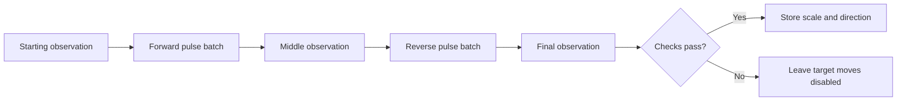

# Calibration

Calibration determines a service's installation-specific parameters. It is an explicit lifecycle phase, distinct from initialization. The slide needs a measured scale and electrical direction before accepting absolute moves.

## Slide distance test

Use `slide_nodes.calibrate(steps=1000)` to calibrate the slide. The service performs:

1. Read the starting position.
2. Run the requested pulse count in electrical direction `True`, then read position.
3. Run the same count in direction `False`, then read position.
4. Check displacement size, opposite signs, and forward/reverse agreement.
5. Compute `steps_per_mm` and which electrical direction increases position.



The provider prints start/end positions for each leg in mm. A successful report contains `positions_mm`, `forward_mm`, `reverse_mm`, `steps_each_direction`, `steps_per_mm`, and `positive_direction`. A failed attempt clears the previous calibration. No automatic motion retry is performed.

## Noise and measurement scale

The current algorithm takes one reading at each boundary. At the far end of the tested slide, stationary readings varied by several millimetres while a calibration leg moved only a few millimetres. This can produce disagreement or a misleading scale even when the mechanism visibly moves.

Measure repeatability before increasing travel:

```python
for _ in range(10):
    print(slide_nodes.position()['value'] * 1000)
```

Keep the carriage stationary during the set. Compare readings near and far from the sensor. Check that the target remains in view throughout travel. More calibration steps increase displacement but also physical travel; the current target range does not limit these legs.

Multi-sample stationary averaging and noise-aware acceptance are potential improvements, not current behavior. Do not interpret a successful small-displacement calibration as a precise encoder measurement.

## Other services

Declare a lifecycle calibration hook and an operation contract for its arguments. Node-wide calibration runs dependency hooks first. A service-specific call invokes only that service's hook. Track state with `node.calibration_status()` or the node status HTTP endpoint.
