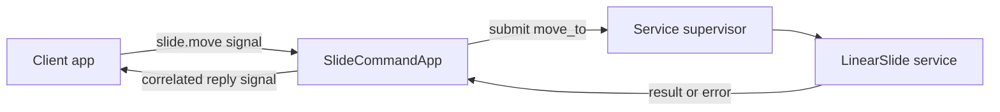

# Basic Concepts

## Entity, node, and device

An **entity** identifies a cooperating robot or installation, such as `SlideDemo` or `Robie1`. A **node** is a logical assembly with its own manifest, services, apps, task registry, and identity. A **device** is the physical board or computer that hosts one or more nodes.

A node belongs to one host at a time. Multiple nodes may share a device; cooperating nodes may be placed on different devices. Moving a node to another device changes its deployment and transport choices, rather than the meaning of its application signals.

## Layers and responsibilities

| Concept | Responsibility | Slide example |
| --- | --- | --- |
| Platform | Firmware, GPIO, I2C and networking | MicroPython on ESP32-S3 |
| Runtime | Construct, connect, schedule and supervise | `NodeRuntime` |
| Service | Offer a reusable capability | Motor, distance sensor, slide controller |
| Adapter | Translate a capability or coordinate system | Distance to carriage position |
| App | Run application logic using a node | Receive move commands; request one move |
| Flow | Declaratively coordinate operations and signals | Move, wait for an operator, then continue |
| Signal | Carry an event or application command | `slide.move`, `motion.target.reached` |

## Operation versus signal

An **operation** invokes an allowlisted method through a service's manifest and supervisor. It has validated arguments, concurrency rules, and a tracked result. A **signal** is a named envelope delivered to subscribers. A signal becomes a service command only when an app or runtime handler interprets it and submits an operation.

## Units and coordinates

Capability boundaries use SI units: metres for linear distance and position, radians for angles. Convenience APIs may use millimetres when their names or arguments make that explicit. The position adapter owns the zero offset, direction, and reference frame; a raw sensor does not know where a carriage is installed.

Logical separation is not process isolation, a security boundary, or automatic hardware arbitration. Give each physical peripheral one owner.
