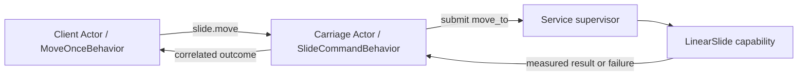

# The Primitive Fabric mental model

Primitive Fabric connects physical capabilities and computation into coordinated applications. Actors perform Behaviors on Fabric Nodes; signals and managed operations connect their work.

## Participants and execution

| Term | Meaning |
| --- | --- |
| Device | Physical board or computer, including its processing, storage, power, and attached hardware |
| DeviceHost | Hosts multiple Fabric Nodes on one cooperative event loop |
| FabricNode | Runtime host with an entity/node identity, services, Actors, workflows, and task registry |
| Actor | Named participant owning one configured Behavior instance and its managed execution |
| Behavior | Code that prepares, performs, and cleans up an Actor's work |
| Task | One tracked execution with a result, failure, or cancellation |
| Capability | Versioned interface and semantic constraints supplied by a service |
| Fabric | Connected runtime, communication, discovery, and management facilities |

An Actor ID is unique within its Fabric Node. Its address is `(entity, node, actor)`. Its task ID identifies an execution rather than the participant itself. `node.actors['carriage'].behavior` accesses the assigned implementation; `describe()` returns public lifecycle and execution metadata.

A Fabric Node can host several Actors, and an Actor can use several services. Drivers and adapters remain capability providers without requiring their own Actor. Multiple Fabric Nodes on one DeviceHost share an interpreter and filesystem; their identities do not create isolated failure domains.

## Behaviors and workflows

A Behavior factory receives `(actor, **config)`. It accesses the host through `actor.node`, prepares subscriptions in `start()`, performs cooperative work in `run()`, and releases its resources in `stop()`. A resident Actor's unexpected exit triggers node health handling. A oneshot Actor may return normally and expose its result through `await actor.wait()`.

`WorkflowBehavior` assigns an operation/signal graph to an Actor. The graph lives in `flows`; its `nodes` keys identify steps, not Fabric Nodes. A workflow has one coordinator, and can request leased actions from configured peer nodes. Coordinator failover is outside the runtime contract.

## Services, operations, and signals

Drivers own hardware protocols. Adapters translate units or installation meaning. Composites coordinate capability providers. A service's declared operations provide validated arguments, resource claims, and tracked outcomes.

Signals carry event envelopes between subscribers. They are routed by entity and node. A Behavior interprets a signal and may submit an operation; receiving a message alone is not confirmation that a physical action completed. Correlation IDs connect commands with their responses.

```mermaid
flowchart LR
    Client[Client Actor / MoveOnceBehavior] -->|slide.move| Carriage[Carriage Actor / SlideCommandBehavior]
    Carriage -->|submit move_to| Supervisor[Service supervisor]
    Supervisor --> Slide[LinearSlide capability]
    Slide -->|measured result or failure| Carriage
    Carriage -->|correlated outcome| Client
```

## The Loom and ROSMicroPy

The Loom is the authoring, deployment, and observation environment. A deployment defines which external services it needs; local Behaviors can run with The Loom disconnected. ILA, the Intelligent Loom Assistant, is a planned assistant using the same management interfaces.

ROSMicroPy is foundational to embedded ROS integration. ESP-NOW local coordination can run without a ROS connection; Behaviors that depend on external ROS participants require those participants and their communication path. The [ROS guide](ros-integration.html) describes typed interfaces and agent dependencies.

## Placement and physical ownership

Manifests assign Actors to specific Fabric Nodes and bind services to resources. Each physical peripheral needs one owner. Local claims arbitrate operations but do not establish distributed Actor ownership after a network partition.

A data-processing Behavior may eventually be eligible for alternative-host recovery. A motor-control Behavior still requires access to its motor. Planned handoff needs checkpoint/restore and an ownership protocol; crash recovery can use only state already saved. These features are specified in the [management roadmap](fabric-management.html).

Capability boundaries use SI units and explicit reference frames. Position adapters own offsets and direction; sensors report observations in their defined coordinates.
