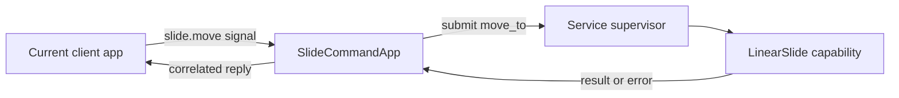

# The Somatic Mesh mental model

Somatic Mesh is a distributed compute framework and management system for small devices. Define participants and their work, then bind that work to the capabilities and resources available across connected devices.

**Status:** Actors, Fabric Nodes, and the separated deployment model below describe the product direction. Current APIs still assemble logical nodes from services, apps, and flows. These concepts do not introduce new supported manifest fields or migration guarantees.

## Actors and Behaviors

An **Actor** is a stable logical participant: for example, a carriage controller, measurement coordinator, or data processor. Its intended contract includes identity, an assigned Behavior and version, configuration, explicit state, message handling, and lifecycle. Its identity should remain stable when an eligible deployment changes its location.

A **Behavior** defines what an Actor does and how it responds to actions or signals. It may be implemented by application code or a declarative workflow. A **task** is a managed execution instance, such as one move or a running flow; it is not the Actor's identity. A **capability** describes what a provider can do, not the Behavior that decides when to use it.

Do not turn every driver or adapter into an Actor. An Actor can coordinate several services. The current `NodeRuntime` may contain several such participants in the future; renaming it to Actor would conflate hosting with application identity.

## Fabric, hosts, and devices

| Term | Product meaning | Current implementation relationship |
| --- | --- | --- |
| Fabric | Connected execution and management infrastructure | Runtime, signals, transports, control, and discovery are foundations; placement and recovery management remain proposed |
| Device | Physical board or computer | Owns hardware connections and supplies processing, memory, storage, and power |
| Fabric Node | Runtime host that offers an execution location for Actors | Target vocabulary; there is no separate Fabric Node API yet |
| Logical node | Current manifest-defined assembly with an entity/node identity | `NodeRuntime` holds services, apps, flows, and tasks; `NodeHost` can run several logical nodes on one device |
| Entity | Scope for cooperating participants in an installation | Existing `identity.entity`, such as `SlideDemo` or `Robie1`; not a new Fabric identifier schema |

Several logical nodes share an interpreter and filesystem. They are not isolated failure domains or independent package environments. A host failure can affect all of them. Each physical peripheral needs one owner; logical separation does not provide hardware arbitration.

## The Loom and ILA

**The Loom** is the proposed product name for Robot Architect, the authoring, deployment, and observation environment. Its current extension and repository names remain Robot Architect / `RobotArchitect`. **ILA** (Intelligent Loom Assistant, pronounced “eye-la”) is the proposed assistant within The Loom, using the same management interfaces and permissions as other clients.

The Loom should define desired applications, resolve exact software versions, deliver code, and show running state. Onboard management should enforce readiness, ownership, and permitted recovery. The intended deployed system does not depend on The Loom or internet access remaining connected.

## Three separate descriptions

| Description | Contains |
| --- | --- |
| Application definition | Actors, assigned Behaviors, connections, capability requirements, constraints, and recovery policy |
| Device profile | Board identity, firmware, pins, peripherals, resource budgets, and available hardware capabilities |
| Deployment plan | Actor placement, concrete bindings, exact software revisions, and eligible fallback hosts |

This separation is proposed. Today's `rp.node/v1` manifest combines application, hardware, and deployment information. Continue to use the documented [current format](nodes.html); no new Actor schema is defined here.

## Services, operations, and signals

Services provide reusable capabilities. Drivers access hardware, adapters translate meaning or coordinates, and composites coordinate capabilities into a higher-level service. Apps and flows currently express application behavior.

An **operation** invokes an allowlisted service method through the supervisor, with validated arguments, concurrency rules, and a tracked result. A **signal** is an event envelope delivered to subscribers. It becomes a command only when a handler interprets it and submits an operation.

```mermaid
flowchart LR
    Client[Current client app] -->|slide.move signal| Handler[SlideCommandApp]
    Handler -->|submit move_to| Supervisor[Service supervisor]
    Supervisor --> Slide[LinearSlide capability]
    Slide -->|result or error| Handler
    Handler -->|correlated reply| Client
```

In the target model, these apps could implement Behaviors for a client Actor and a carriage Actor. Today their addresses and lifecycles remain tied to configured logical nodes.

## Placement has physical limits

A Behavior that processes data may be eligible to restart on another host. A Behavior that depends on a directly wired motor still needs access to that motor. A dead board's electrical connections cannot be restored by moving software.

Planned handoff can stop work and save state before transfer. Crash recovery can use only state already persisted or replicated. Resource-aware placement must consider memory, processor load, power, temperature, and communication cost; moving CPU work does not remove a local motor's power demand. See the [Fabric management proposal](fabric-management.html).

## Units and coordinates

Capability boundaries use SI units: metres for linear distance and position, radians for angles. Convenience APIs may use millimetres when explicit. Position adapters own offsets, direction, and reference frames; a raw sensor does not know where a carriage is installed.
