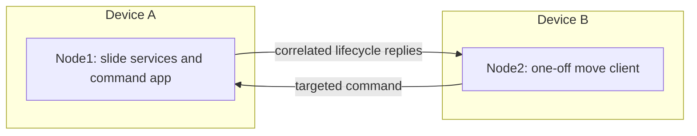

# Multiple Devices

This guide describes the current manual installation workflow. See the
[provisioning and bootstrap proposal](bootstrap.html) for planned USB identity
assignment, wireless software maintenance through Robot Architect, and robot-wide
readiness checks.

Install the **same** `examples/slide_nodes/package.json` on both boards. The device manifests use a shared ESP-NOW transport that delivers between local logical nodes and broadcasts over the radio.

## RobotArchitect discovery

Both resident roles include Wi-Fi, HTTP, catalog and the gateway app. Configure
`WIFI_SSID` and `WIFI_PASSWORD` through `rpstack.env.setEnv` on each board before
startup. Match the access point channel in `slide_node1.json`, `slide_node2.json`
and `slide_client_host.json` (default 6).

The slide role hosts the gateway on node1. The client role starts a persistent
`node2-host` gateway and creates one-off node2 apps for commands. Connect
RobotArchitect's System view to the URL printed at startup, or read
`slide_nodes.status()['gateway_url']`. `/api/robot` includes discovered peer nodes,
services, capabilities and apps; it excludes deployment credentials.

Catalogs announce every 5 seconds and expire peers after 20 seconds. A short-lived
node2 may disappear before a full profile is received; its resident host remains
available. Catalog discovery does not authorize remote operation execution.

## One device or two



On device A, connected to the hardware:

```python
import slide_nodes
slide_nodes.start()
```

On device B:

```python
import slide_nodes
slide_nodes.start('client')
print(slide_nodes.position())
slide_nodes.calibrate(steps=1000)
slide_nodes.set_range(30, 300)
slide_nodes.demo(100)
```

For a single board, start the normal slide role and run the same command helpers at its prompt. Do not start a second copy of node1. Keep at most one active node2 client per entity in this demo.

## Radio and ownership

Both boards need matching entity and radio channel, plus distinct node identities. The default channel is 6. ESP-NOW does not require a router; an existing Wi-Fi connection must use the compatible channel. Separate installations should use separate entities.

`SharedEspNowTransport` shares one radio per interpreter. The last local owner closes it. Do not independently create another ESP-NOW radio owner or another asyncio loop while the launcher is active. Host simulations instead use in-process or simulated transports.

## Stop behavior

`slide_nodes.stop()` on A stops the slide node and its motion. On B it stops only B's client host. Ctrl-C cancels the local wait; it does not guarantee a remote move stopped. After timeout, inspect/stop the provider before deciding whether to issue another command.

The client's `status()['node1'] == 'remote'` describes placement, not continuous remote health monitoring. The client performs a readiness exchange for each command.
