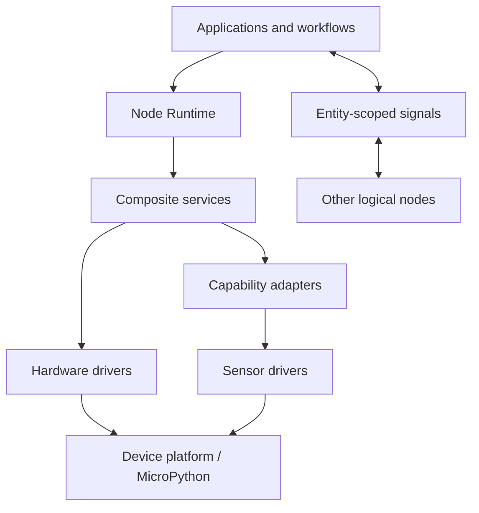

# Build robots from reusable capabilities

RPStack assembles small hardware services into applications that can run on one device or cooperate across devices. A manifest describes each logical node; the runtime constructs services, connects capabilities, and manages their work.

Start with a host simulation, then install the linear-slide example on an ESP32. The same signal-driven client can run beside the slide service or on a second device.

## Choose a path

- [Getting Started](getting-started.html): run a simulation and install your first device.
- [Basic Concepts](concepts.html): understand entities, nodes, apps, services, and signals.
- [ROS 2 Integration](ros-integration.html): use typed telemetry and the linear-slide action gateway with ROSMicroPy.
- [Provisioning & Bootstrap](bootstrap.html): proposed identity provisioning, Architect-managed updates, and coordinated startup.
- [Service & App Registries](registries.html): proposed versioned descriptors, dependency resolution, and private registry sources.
- [Linear Slide](linear-slide.html): calibrate, set a range, and issue a move from the REPL.
- [API Reference](api.html): invoke operations, track tasks, and change configuration.

## Architecture at a glance

See [package structure and terminology](architecture.html) for dependency boundaries and the service model.

## What lives where

| Directory | Purpose |
| --- | --- |
| `RPStack/foundation/` | Capability contracts and portable execution utilities |
| `RPStack/runtime/` | Node supervision, tasks, workflows, signals and discovery |
| `RPStack/transports/` | ESP-NOW and ROS signal adapters |
| `RPStack/control/` | HTTP and shell control interfaces |
| `RPStack/platform/` | Boot and environment helpers |
| `RPStack/observability/` | Telemetry |
| `RPStack/services/` | Hardware drivers, capability providers, adapters and composites |
| `RPStack/apps/` | Reusable node applications, including the robot gateway and slide command apps |
| `examples/` | Runnable assemblies, simulations and hardware deployments |
| `RPStack/spec/` | Manifest schemas and contract documentation |
| `pages/` | This documentation site |
| `ROSMicroPy/` | Firmware and ROS integration project |
| `RPStack_WebTester/`, `RobotArchitect/` | Related tools; inspect their own READMEs for setup |

## Implementation status

Unless explicitly marked as a design proposal, this documentation describes the current repository implementation. The provisioning/bootstrap and service/app registry pages describe planned behavior, not currently available features. Host simulations do not establish physical motor timing, radio reliability, or sensor accuracy. Current slide calibration uses single readings at the boundaries of each leg; averaging and noise-aware calibration are not yet implemented.
