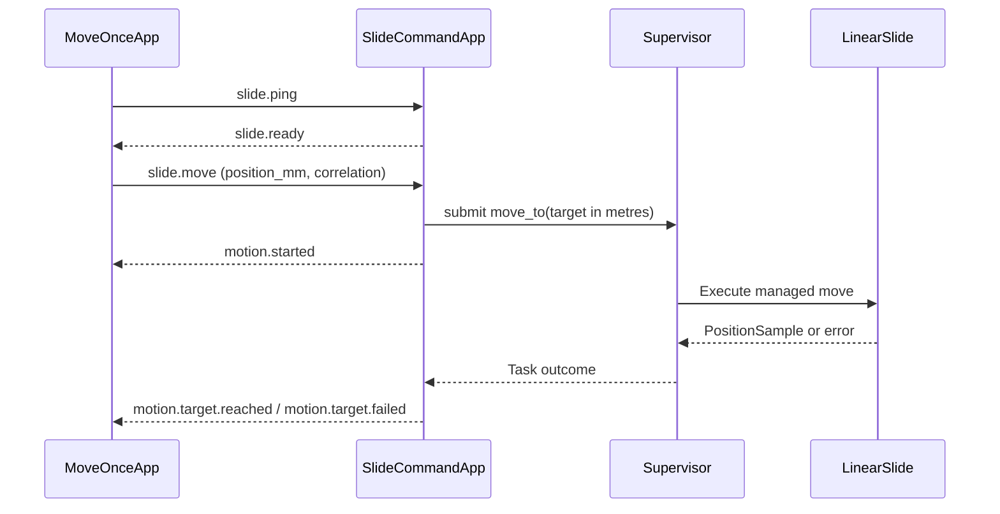

# Linear Slide

The slide deployment combines a motor, TOF distance sensor, position adapter, composite controller, resident command app, and one-off client app.

## Command lifecycle



`motion.started` announces operation execution; it is not sensor confirmation that the carriage moved. The client subscribes before sending, filters by source and correlation, prints replies, and exits after the terminal result.

## REPL workflow

```python
import slide_nodes
slide_nodes.start()
print(slide_nodes.position())
report = slide_nodes.calibrate(steps=1000)
slide_nodes.set_range(30, 300)
slide_nodes.demo(100)
slide_nodes.demo(200, timeout_s=60)
slide_nodes.status()
slide_nodes.stop()
```

## Range and step budget

The node1 manifests configure `min_position_m: 0.03`, `max_position_m: 0.3`, and `max_steps: 100000`. Target bounds are inclusive and interpreted in the position adapter's coordinate frame. `set_range(min_mm, max_mm)` changes bounds in memory until restart; update the manifest for persistence. Bounds must be finite and strictly ordered. Changes during active movement are rejected.

These bounds reject out-of-range **targets**. They are not physical end stops, and do not constrain the calibration legs or fixed-step jogs. Feedback and scale error can also produce overshoot within a pulse batch.

A move of 100 mm at 222 steps/mm needs roughly 22,200 steps. The separate step budget remains fixed when you change range; it bounds total commanded steps rather than describing travel geometry.

## Motion and observations

After calibration, the controller estimates a pulse batch covering about 96% of the observed target error. It runs that batch uninterrupted, then takes a fresh position reading and adjusts the remaining motion. Pauses at these observation boundaries are expected; sensor reads are not interleaved with individual pulses.

The configured 100 µs delay is applied to both HIGH and LOW portions of a pulse. Python and GPIO overhead add time. There is no acceleration profile or guaranteed pulse frequency.

The current VL53L4CD adapter stops/clears and restarts ranging for each observation, waits at least a configured measurement interval plus margin, checks data-ready, reads the range, and stops again. This avoids requiring the host to observe a brief ready-low transition.
