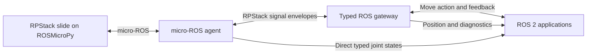

# ROS 2 integration

RPStack manages device capabilities and their execution. ROS 2 applications can
use those capabilities through typed interfaces, while controllers retain their
MicroPython service runtime and manifest-driven hardware bindings.

## Device and desktop responsibilities

ROSMicroPy already includes an `rclpy` implementation on top of micro-ROS. It
supports typed publishers and subscribers. Its current action-server, executor,
and future support is incomplete, so the optional desktop `SlideRosGateway`
provides the linear-slide action facade using full CPython rclpy.

The controller's ROS transport owns one native worker. Optional typed publishers
are registered before that worker starts. The desktop gateway is independent of
Robot Architect and can run on an onboard Linux computer.

## Linear-slide interfaces

| Interface | Meaning |
| --- | --- |
| `sensor_msgs/msg/JointState` from the controller | Actual linear measurement for a configured prismatic joint |
| `rpstack_interfaces/msg/LinearPosition` from the gateway | Measured position in metres, validity, quality, frame, and source timestamp |
| `rpstack_interfaces/action/MoveLinear` | Absolute target, measured feedback, and explicit confirmed/unconfirmed outcome |
| `diagnostic_msgs/msg/DiagnosticArray` | Gateway view of slide readiness, connectivity, and faults |

The default gateway namespace is `/rpstack/slide`, with endpoints `position`,
`move`, and `diagnostics`. The example publishes direct firmware joint states on
`/rpstack/slide_device/joint_states`. This is a linear-slide adapter, not a claim
that every RPStack operation automatically becomes a ROS interface.

## Admission and cancellation

The gateway checks fresh worker health, calibration, valid position, and travel
bounds before admitting one goal. The device supervisor still validates commands
and arbitrates resources against local workflows and other clients. Calibration
is explicit and never triggered by starting the gateway.

Measured feedback is emitted by the slide during its existing observation steps.
The gateway does not compete for sensors while motion owns them. Feedback can be
sparse during a blocking motor batch; no interpolated positions are invented.

A ROS cancel request propagates through the leased remote-operation protocol.
The action reports cancellation only after worker cleanup is confirmed, or when
dispatch never occurred. If cancellation is lost, renewal stops and the receiver
lease provides the cooperative fallback. If completion wins the race, the action
can still succeed.

Disconnects, worker resets, and lost results never cause an automatic move retry.
Uncertain outcomes abort and block further goals until the operator checks the
device and restarts the gateway. Software leases are not hardware emergency stops.

## Time, frames, and delivery

The gateway stamps positions with ROS receipt time and preserves the original
device timestamp separately. The direct firmware joint-state publisher uses an
unspecified zero stamp because the current shim exposes no synchronized ROS clock.
Neither path treats device monotonic time as ROS time or performs coordinate
transforms. Frame labels must describe the actual measurement coordinates.

Desktop position uses sensor-data QoS; diagnostics are volatile periodic reports.
Consumers must detect missing diagnostics rather than retaining readiness forever.
The firmware shim's QoS arguments currently do not configure native QoS. ROS
delivery guarantees also do not extend automatically across a lossy mesh segment.

## Deployment and validation

The repository's `examples/ros_slide/README.md` contains the complete USB install,
agent configuration, colcon build, calibration, and ROS CLI workflow. The gateway
app is under `RPStack/apps/ros_gateway`; generated ROS interfaces are under
`ros2/rpstack_interfaces`.

Host tests exercise managed execution, resource exclusion, cancellation, lease
expiry, and packet loss. Firmware tests load the actual ROSMicroPy Python shim
with its native module substituted. A ROS 2 Jazzy workflow builds the interfaces
and runs real action/topic tests. These tests do not establish physical stop
timing, native serialization correctness on the board, or radio reliability.

## Further integration

Additional adapters can expose sensors as standard ROS messages and long-running
operations as actions. Reuse standard types only when their semantics fit; the
slide does not advertise trajectory execution that it does not implement.
Generic registry-driven adapter generation and Architect UI configuration remain
future work. See [Service and app registries](registries.html) and
[Device provisioning and bootstrap](bootstrap.html) for those proposals.
