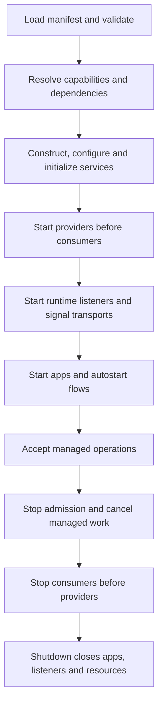

# Runtime Level

The runtime handles assembly and execution rather than implementing the mechanics of a particular robot.

| Package | Responsibility |
| --- | --- |
| `node_runtime` | Manifest loading, capability resolution, lifecycle, node hosting |
| `execution_engine` | Tracked tasks, operations, behavior graphs and remote actions |
| `signals` | Entity-scoped publication, subscriptions and routing |
| `espnow`, `ros_signals` | Network transport adapters |
| `micropyserver`, `shell` | HTTP and interactive controls |
| `catalog` | Discovery infrastructure used by gateway applications |
| `bootmgr`, `env`, `opentelemetry` | Boot, environment and observability facilities |

## Startup and shutdown



`stop()` stops application services and flows while controls remain available. `reset()` rebuilds service instances. `shutdown()` also closes runtime listeners, apps, and platform resources. Failed partial startup cleans up initialized instances.

## Managed operations

```python
result = await node.invoke('slide', 'get_range', {})
job_id = node.submit('slide', 'move_to', {'target': 0.1})
result = await node.tasks.wait(job_id)
```

`submit` reserves claims immediately and returns a task ID. Exclusive operations also claim transitive dependencies: a slide move claims the motor and position chain. Conflicting work fails instead of accumulating an unbounded motion queue. Operations must be declared in the manifest.

The task registry tracks services, listeners, operations, flows, and requests, retaining a bounded history of completed work. The shell and HTTP task API expose this state.

## Concurrency

The execution engine uses cooperative asyncio. Blocking code does not become cooperative simply because it runs in a task. The slide deployment specifically uses a background runtime thread to keep the native REPL free, plus a pulse worker for uninterrupted batches. That is a deployment/driver arrangement, not a general thread-per-service runtime.

## Calibration phase

Calibration is explicit and optional. A service opts in through `service.lifecycle.calibrate`. No calibration runs automatically during startup or reset.

```python
await node.calibrate('slide', {'steps': 1000})
await node.calibrate(arguments={'slide': {'steps': 1000}})
print(node.calibration_status())
```

Node-wide calibration runs declared hooks in dependency order. Services without hooks are `not_required`. Selected services and their dependencies are claimed for the phase; failures and cancellation are tracked. See [Calibration](calibration.html).
