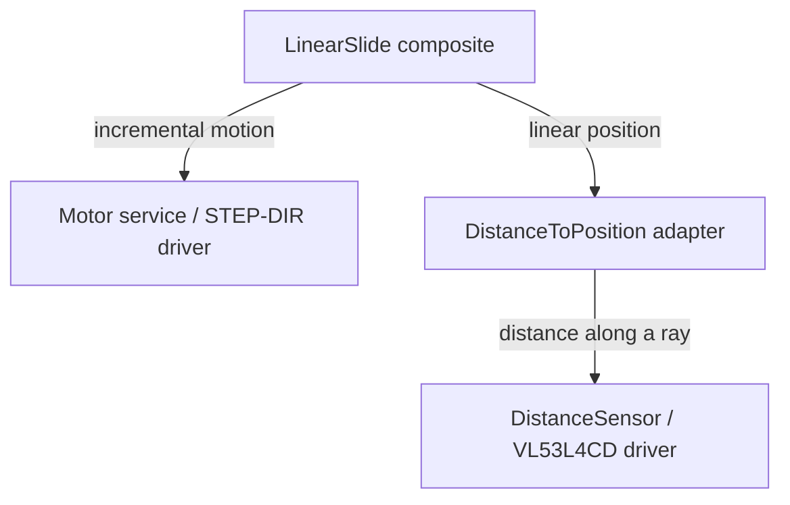

# Services Level

Services expose hardware-independent capabilities. A component contract describes configuration, lifecycle hooks, operations, required/provided interfaces, implementation choices, and tests.

For planned publishing and discovery in Robot Architect, see
[Service and app registries](registries.html). That design adds immutable version
records and explicit dependency resolution across public and private sources.

## Drivers, adapters, composites



A **driver** owns a device protocol. An **adapter** translates meaning or coordinates. A **composite** coordinates capabilities into mechanism behavior. Runtime-bound composites do not own their dependencies' lifecycle; the supervisor shuts them down.

## Capability contracts

| Interface | Main operation | Canonical result or input |
| --- | --- | --- |
| `sensing.distance_observer` | `distance()` | DistanceSample, metres |
| `motion.position_observer` | `position()` | PositionSample, metres or radians |
| `motion.motion_actuator` | `command(direction, amount)` | Relative movement, constrained by mode |
| `motion.position_actuator` | `move_to(target)` | Absolute target in canonical units |

Measurements carry `value`, `unit`, `timestamp_ns`, `valid`, `quality`, and `reference_frame`. Position samples add `kind`. An absent timestamp or a default quality of 1.0 is not evidence of precision. In particular, the current slide output does not estimate stationary TOF noise in its quality field.

## Describe an operation

Service manifest fragment:

```yaml
operations:
  move_to:
    method: move_to
    arguments:
      target: {type: number, required: true, unit: m}
    returns: {type: PositionSample, quantity: linear, unit: m}
    concurrency: exclusive
    cancellable: true
    safe_state: stop
```

The manifest is an allowlist, not just documentation. Keep the declared operation arguments and implementation signature aligned. Device node manifests embed component contracts, so update those embedded copies when changing an API.

## Add a service

1. Define the capability it provides and dependencies it requires.
2. Implement configuration, initialization, operations, status, and cleanup.
3. Add `component.yaml` and MIP package mappings beside `src/` and `test/`.
4. Exercise it with fake capability providers on the host.
5. Assemble it in a node manifest with explicit hardware resources and bindings.

Use cooperative waits for device readiness and stop physical work in cancellation/error cleanup. Keep installation-specific offsets in adapters and application sequencing in apps or flows.
