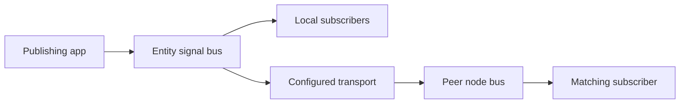

# Signals

Signals connect publishers and subscribers within an entity. Applications use the same envelope through local delivery, in-process transports, ESP-NOW, or ROS adapters.

## Publish and subscribe

Inside an app with a node reference:

```python
subscription = node.signals.subscribe(
    'motion.target.reached', source='node1', correlation=run_id)
try:
    node.publish_signal('slide.move', {'position_mm': 100},
                        target='node1', correlation=run_id)
    result = await subscription.get(timeout=30)
finally:
    subscription.close()
```

Create a unique `run_id` for each request. Subscribe before sending so a quick reply cannot be missed. The complete slide client also probes readiness and handles failure signals; use it for device operation.

## Routing

`signals.routes` selects the destinations of locally published messages. Omitted routes default to local delivery. Transport IDs identify configured adapters; bridge rules explicitly forward between transports. Incoming messages addressed to this node or `*` are delivered locally. Identity and correlation filters keep unrelated responses separate.



## Delivery semantics

Publishing enqueues a bounded message; transport tasks perform network I/O. Signals are not a persistent event log. Late subscribers do not receive earlier publications. Queue overflow and listener failures are explicit failure conditions.

Duplicate suppression and bounded relaying do not make physical commands exactly-once across arbitrary failures. The slide demo retries readiness probes but sends each move command once. A lost reply produces a timeout, which does not prove that motion stopped.

Names beginning `_rp.` are reserved for runtime protocols. Application names such as `slide.move` and `motion.target.reached` belong to application contracts.
